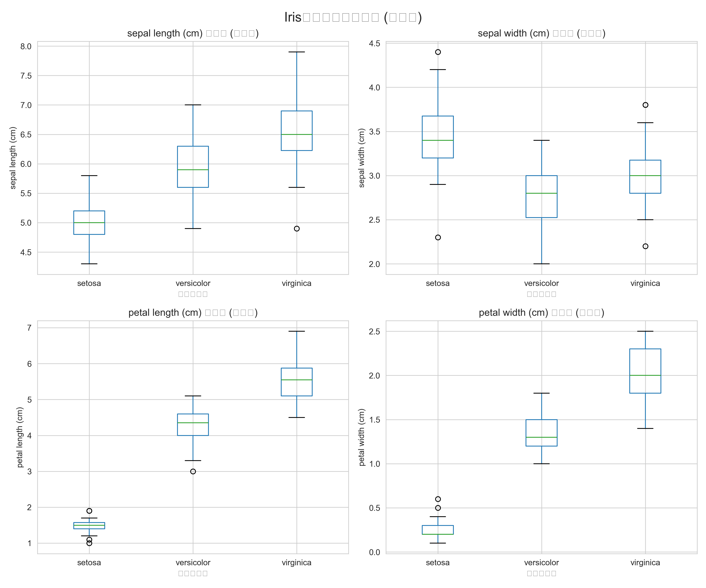
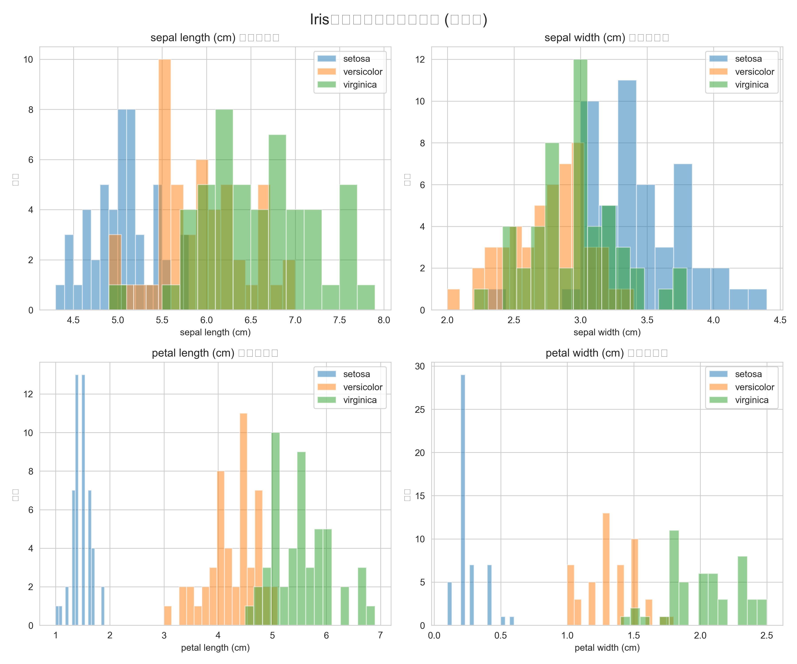
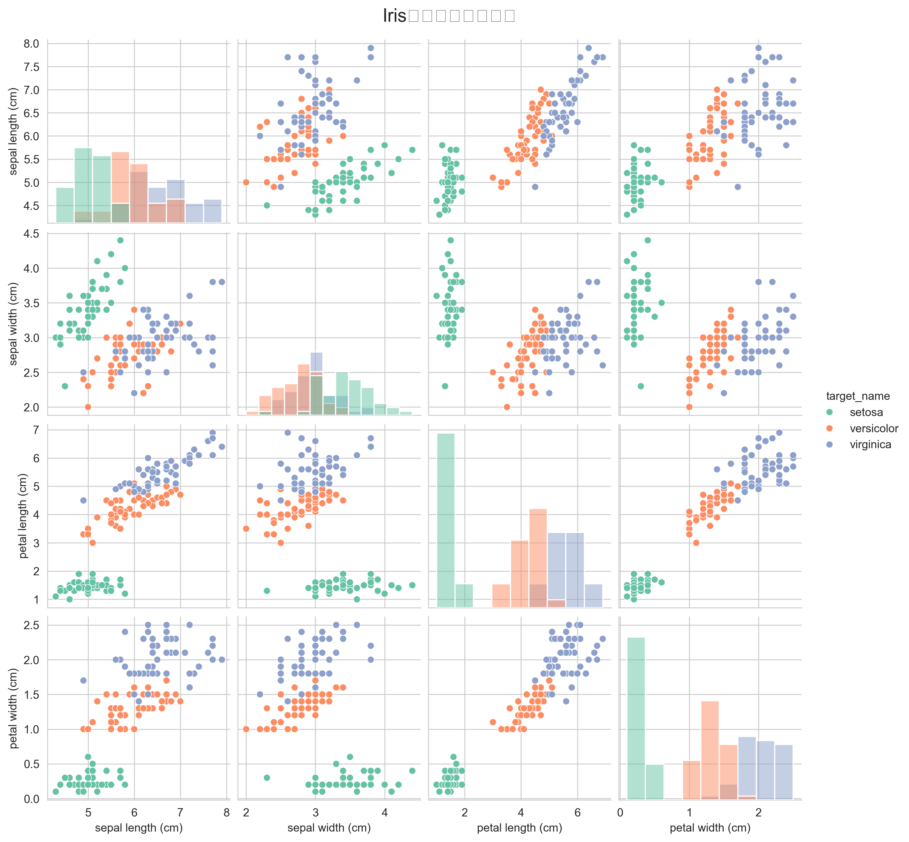
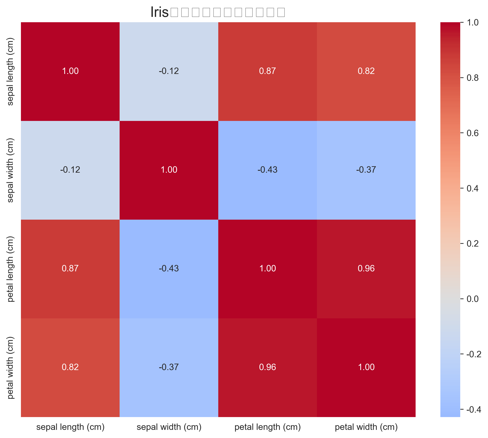

# Iris鸢尾花数据集数据分析报告

## 1. 项目概述
本项目对经典的Iris（鸢尾花）数据集进行了全面的探索性数据分析（EDA）和可视化。Iris数据集是机器学习领域最著名的数据集之一，常用于分类算法的演示和测试。

**分析目标**：
- 理解数据集的基本结构和特征
- 探索不同鸢尾花种类（Setosa, Versicolor, Virginica）在形态特征上的差异
- 可视化特征分布和特征间的关系
- 为后续的分类建模提供数据洞察

**数据集信息**：
- 样本数量：150个（每个种类50个）
- 特征数量：4个数值特征
  - 花萼长度（sepal length, cm）
  - 花萼宽度（sepal width, cm）
  - 花瓣长度（petal length, cm）
  - 花瓣宽度（petal width, cm）
- 目标变量：鸢尾花种类（3类）

## 2. 数据概览

### 2.1 基本统计信息
数据集完整无缺失值。各类别样本均衡（各50个）。

**描述性统计摘要**（详见`描述性统计.txt`）：
- 花萼长度：均值5.84cm，范围4.3-7.9cm
- 花萼宽度：均值3.06cm，范围2.0-4.4cm
- 花瓣长度：均值3.76cm，范围1.0-6.9cm
- 花瓣宽度：均值1.20cm，范围0.1-2.5cm

### 2.2 类别分布
- Setosa: 50个样本
- Versicolor: 50个样本
- Virginica: 50个样本

## 3. 可视化分析

### 3.1 特征分布 - 箱线图

**关键发现**：
- **Setosa类别明显区分**：在花瓣长度和花瓣宽度上，Setosa的值显著小于其他两类，几乎无重叠。
- **Versicolor和Virginica部分重叠**：在花萼特征上，这两类有较多重叠；在花瓣特征上，Virginica整体大于Versicolor。
- **花萼宽度**的分布相对集中，而**花瓣长度**的分布范围最广。

### 3.2 特征分布 - 直方图

**关键发现**：
- Setosa的花瓣特征（长度和宽度）呈现明显的左偏分布（值较小）。
- Virginica的花瓣特征呈现右偏分布（值较大）。
- 花萼特征的分布相对接近正态分布。

### 3.3 特征间关系 - 散点图矩阵

**关键发现**：
- **花瓣长度 vs 花瓣宽度**：呈现极强的正相关关系（相关系数~0.96），且三类在该二维空间中有良好的线性可分性。
- **花萼长度 vs 花萼宽度**：相关性较弱，三类在该空间中有较多重叠。
- **花瓣特征 vs 花萼特征**：Setosa与其他两类在花瓣-花萼组合空间中分离明显。

### 3.4 特征相关性 - 热力图

**相关系数矩阵**（详见`特征相关性矩阵.txt`）：
- 花瓣长度与花瓣宽度：0.96（极强正相关）
- 花瓣长度与花萼长度：0.87（强正相关）
- 花瓣宽度与花萼长度：0.82（强正相关）
- 花萼长度与花萼宽度：-0.12（弱负相关）

## 4. 关键发现总结

1. **类别可分性**：基于花瓣特征（特别是花瓣长度和宽度），三类鸢尾花具有很好的线性可分性，尤其是Setosa与其他两类。

2. **特征重要性**：花瓣特征（长度和宽度）对于区分鸢尾花种类比花萼特征更为重要。

3. **特征相关性**：花瓣长度和宽度高度相关，这可能意味着在建模时需要考虑特征选择或降维以避免多重共线性。

4. **数据质量**：数据完整、无缺失值，各类别样本均衡，适合直接用于分类建模。

## 5. 建议

1. **建模建议**：
   - 可尝试使用线性分类器（如逻辑回归、线性SVM）或决策树等算法。
   - 考虑使用主成分分析（PCA）进行降维，因为花瓣特征高度相关。
   - 特征工程：可创建花瓣面积（长×宽）等衍生特征。

2. **进一步分析方向**：
   - 使用聚类算法（如K-means）验证无监督学习下的类别发现。
   - 进行正式的统计假设检验，验证各类别间特征均值的显著性差异。
   - 构建分类模型并评估性能。

## 6. 生成文件清单

本分析生成的文件均位于`Agent数据分析示例`文件夹中：

| 文件类型 | 文件名 | 描述 |
|---------|--------|------|
| 数据文件 | `iris_data.csv` | 原始数据集（含目标变量） |
| 统计文件 | `描述性统计.txt` | 数值特征的描述性统计 |
| 统计文件 | `特征相关性矩阵.txt` | 特征间相关系数矩阵 |
| 可视化 | `特征箱线图.png` | 按类别显示的特征箱线图 |
| 可视化 | `特征直方图.png` | 按类别显示的特征分布直方图 |
| 可视化 | `散点图矩阵.png` | 特征间关系的散点图矩阵 |
| 可视化 | `相关性热力图.png` | 特征相关性热力图 |
| **报告** | **`Iris数据分析报告.md`** | **本分析报告** |

## 7. 技术栈
- Python 3.x
- 库：Pandas, NumPy, Matplotlib, Seaborn, Scikit-learn

---

*报告生成时间：2025年（分析执行时间）*  
*分析执行者：全能型ReAct Agent*
